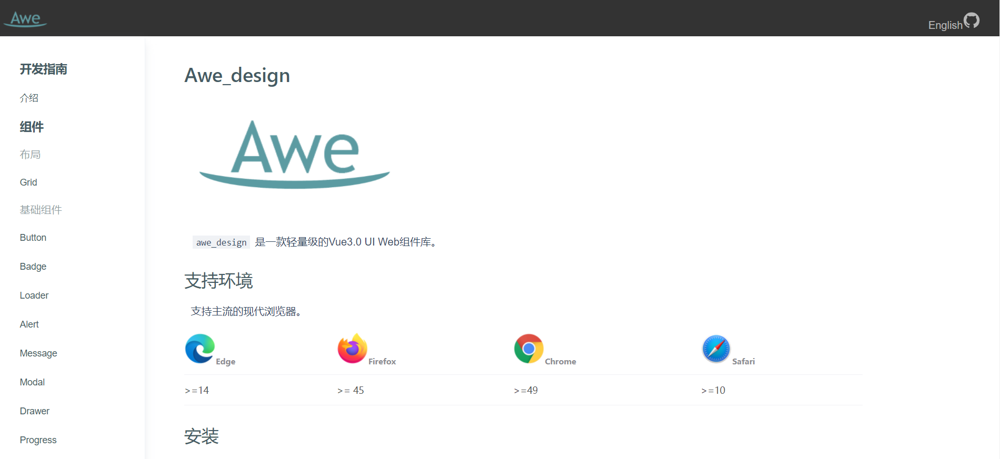

<p align="center">
  <a href="https://awesomezx.github.io/awe">
    <a href="https://awesomezx.github.io/awe">
    
  </a>
  </a>
</p>

<h1 align="center">awe-design</h1>

<h3 align="center">A Light Vue 3.0 Web UI Framework</h3>




## 📦 Install

Use npm

```bash
npm install awe-design --S
```

Use yarn

```bash
yarn add awe-design
```

## 🔨 Quick Start

```javascript
import { createApp } from 'vue'
import App from './App.vue'
import awedesign from 'awe-design'

const app = createApp(App);
app
  .use(awedesign)
  .mount('#app')

```

## 🖥  Browser Support

Supports all major modern browsers.

| </br>Edge | </br>Firefox |  </br>Chrome | </br>Safari |
------------------------------------------------------------------------------------------------------------------------------------------------------ | ------------------------------------------------------------------------------------------------------------------------------------------------------------- | ---------------------------------------------------------------------------------------------------------------------------------------------------------- | --------------------------------------------------------------------------------------------------------------------------------------------------------- |
| >=14                                                                                                                                                  | >= 45                                                                                                                                                         | >=49                                                                                                                                                       | >=10                                                                                                                                                      |


## 🔗 Links

- [Home page](https://awesomezx.github.io/awe)

## ⌨️ Development

Clone locally

```bash
$ git clone https://github.com/AwesomeZx/awe.git
$ cd awe-design
$ yarn install
$ yarn start
```
